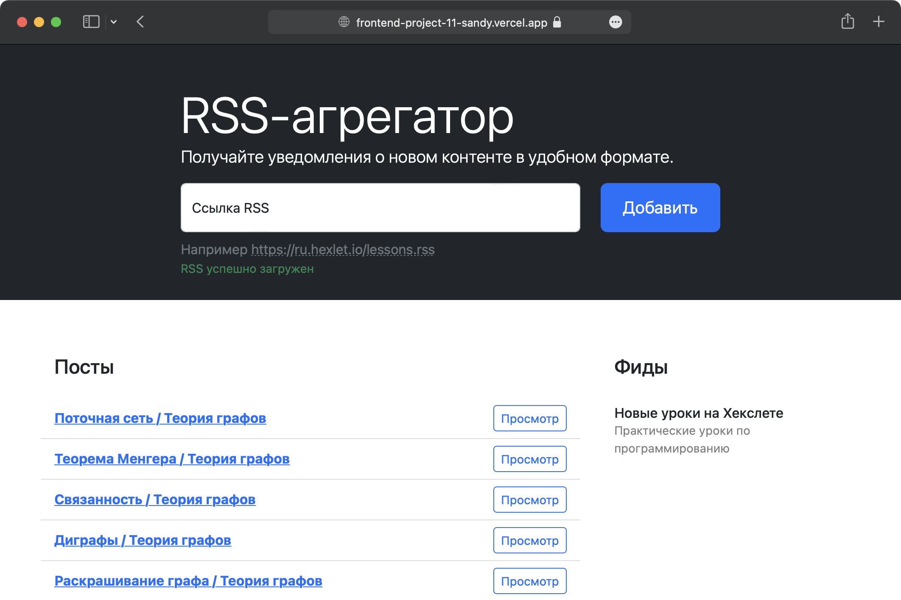

# RSS Aggregator

View demo: [frontend-project-11-sandy.vercel.app](frontend-project-11-sandy.vercel.app)

## About the project

RSS feeds are an easy way to keep track of new content from various sources like news websites, blogs or forums.

**RSS Aggregator** is a simple, easy-to-use, minimalist web application that puts all your RSS feeds in one place.

## Features

- Add unlimited number of feeds
- Get new posts updates in real-time
- Preview posts
- Go to the selected post to read it in full

## Build with

[![Webpack][Webpack-badge]][Webpack-url]
[![Bootstrap][Bootstrap-badge]][Bootstrap-url]
[![i18next][i18next-badge]][i18next-url]
[![Axios][Axios-badge]][Axios-url]
[![onChange][onChange-badge]][onChange-url]
[![yup][yup-badge]][yup-url]

[Webpack-badge]: https://img.shields.io/badge/Webpack-1A6BAC?style=flat&logo=webpack&logoColor=white
[Webpack-url]: https://webpack.js.org

[Bootstrap-badge]: https://img.shields.io/badge/Bootstrap-712CF9?style=flat&logo=bootstrap&logoColor=white
[Bootstrap-url]: https://getbootstrap.com

[i18next-badge]: https://img.shields.io/badge/i18next-26A69A?style=flat&logo=i18next&logoColor=white
[i18next-url]: https://www.i18next.com

[Axios-badge]: https://img.shields.io/badge/Axios-5A29E4?style=flat&logo=i18next&logoColor=white
[Axios-url]: https://axios-http.com

[onChange-badge]: https://img.shields.io/badge/onChange-gray?style=flat&logoColor=white
[onChange-url]: https://github.com/jquense/yup

[yup-badge]: https://img.shields.io/badge/yup-gray?style=flat&logoColor=white
[yup-url]: https://github.com/sindresorhus/on-change

